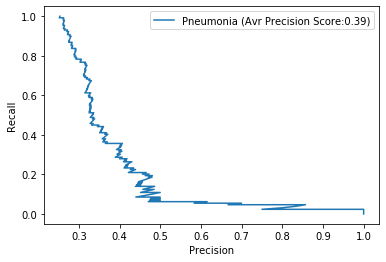
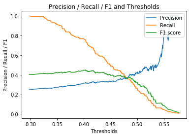
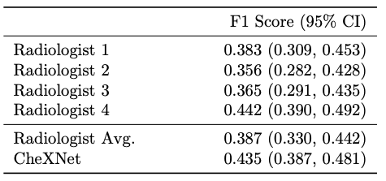

# FDA  Submission

**Name: Tien-Thanh Nguyen**

**Name of your Device: Pneumonia Detector from Chest X-ray**

## Algorithm Description 

### 1. General Information

**Intended Use Statement:** 

Assisting the rediological diagnosis of presence or absence of pneumonia from chest X-rays with the view posistions of AP and PA

**Indications for Use:** 

Reduce the time of radiological diagnosis in chest X-ray for both male and female from 1 to 100 year old, it is used for classification of presence or absence of pneumonia. Patient can also exhibit other diseases in comorbid with pneumonia.

**Device Limitations:** 

System required high computing power computer or cloud-based service, and digital scan of chest X-ray. The prediction could be used to assist radiologists.

**Clinical Impact of Performance:**

- False Negatives mean the patient who has Pneumonia is diagnosed as healthy and may lead to missing treatment.
- False Positives mean the patient who is healthy is diagnosed with Pneumonia and may lead to unnescessary check of the radiologist
- In this situation, False Negative is worst than False Positive.

### 2. Algorithm Design and Function


**DICOM Checking Steps:**

`pydicom` library is used to obtain the data from DICOM image. The algorithms first  checks if the modality is "DX", the patien position is "AP" ot "PA" and the body part examined is "CHEST". If the DICOM does not meet all these criterias, the X-ray will not be assessed.

**Preprocessing Steps:**

The `pixel_array` from the DICOM image is rescaled by dividing with 255. It is also stacked and resized to fit the input shape of the model (1,244,244,3)

**CNN Architecture:**

The CNN architecture is taken from VGG16 with transfer learning.

````python
_________________________________________________________________
Layer (type)                 Output Shape              Param #   
=================================================================
input_1 (InputLayer)         (None, 224, 224, 3)       0         
_________________________________________________________________
block1_conv1 (Conv2D)        (None, 224, 224, 64)      1792      
_________________________________________________________________
block1_conv2 (Conv2D)        (None, 224, 224, 64)      36928     
_________________________________________________________________
block1_pool (MaxPooling2D)   (None, 112, 112, 64)      0         
_________________________________________________________________
block2_conv1 (Conv2D)        (None, 112, 112, 128)     73856     
_________________________________________________________________
block2_conv2 (Conv2D)        (None, 112, 112, 128)     147584    
_________________________________________________________________
block2_pool (MaxPooling2D)   (None, 56, 56, 128)       0         
_________________________________________________________________
block3_conv1 (Conv2D)        (None, 56, 56, 256)       295168    
_________________________________________________________________
block3_conv2 (Conv2D)        (None, 56, 56, 256)       590080    
_________________________________________________________________
block3_conv3 (Conv2D)        (None, 56, 56, 256)       590080    
_________________________________________________________________
block3_pool (MaxPooling2D)   (None, 28, 28, 256)       0         
_________________________________________________________________
block4_conv1 (Conv2D)        (None, 28, 28, 512)       1180160   
_________________________________________________________________
block4_conv2 (Conv2D)        (None, 28, 28, 512)       2359808   
_________________________________________________________________
block4_conv3 (Conv2D)        (None, 28, 28, 512)       2359808   
_________________________________________________________________
block4_pool (MaxPooling2D)   (None, 14, 14, 512)       0         
_________________________________________________________________
block5_conv1 (Conv2D)        (None, 14, 14, 512)       2359808   
_________________________________________________________________
block5_conv2 (Conv2D)        (None, 14, 14, 512)       2359808   
_________________________________________________________________
block5_conv3 (Conv2D)        (None, 14, 14, 512)       2359808   
_________________________________________________________________
block5_pool (MaxPooling2D)   (None, 7, 7, 512)         0         
=================================================================
Total params: 14,714,688
Trainable params: 2,359,808
Non-trainable params: 12,354,880

_________________________________________________________________
Layer (type)                 Output Shape              Param #   
=================================================================
model_1 (Model)              (None, 7, 7, 512)         14714688  
_________________________________________________________________
flatten_1 (Flatten)          (None, 25088)             0         
_________________________________________________________________
dense_1 (Dense)              (None, 512)               12845568  
_________________________________________________________________
dropout_1 (Dropout)          (None, 512)               0         
_________________________________________________________________
dense_2 (Dense)              (None, 128)               65664     
_________________________________________________________________
dropout_2 (Dropout)          (None, 128)               0         
_________________________________________________________________
dense_3 (Dense)              (None, 1)                 129       
=================================================================
Total params: 27,626,049
Trainable params: 15,271,169
Non-trainable params: 12,354,880
````

### 3. Algorithm Training

**Parameters:**

* Types of augmentation used during training: `horizontal_flip = True, 
                                  vertical_flip = False, 
                                  height_shift_range= 0.1, 
                                  width_shift_range=0.1, 
                                  rotation_range=20, 
                                  shear_range = 0.1,
                                  zoom_range=0.1)`
                                  
* Batch size: 64
* Optimizer learning rate: `1e-4` and drop 50% after every 10 epochs
* Layers of pre-existing architecture that were frozen: 1st 17 layers were frozen
* Layers of pre-existing architecture that were fine-tuned: `block5_conv3` and `block5_pool`
* Layers added to pre-existing architecture: `flatten` layer forlow with 3 `dense` layer and 2 `dropout` layer

* Algorithm training performnance visualization


* AUC (Area Under The Curve) ROC (Receiver Operating Characteristics) curve


* Precision-Recall curve




**Final Threshold and Explanation:**



To have balance between precision and recall, I choose to threshold `0.4035850763320923` to have maximum F1: `0.44907407407407407`

### 4. Databases

Datasets are part of the NIH chest X-rays database

**Description of Training Dataset:** 

Training dataset has the balance between positive and negative cases.

**Description of Validation Dataset:** 

Validation dataset has 25% of positive cases which is align with the percentage in clinical settings.

### 5. Ground Truth

The groundtruth is NLP-derived labeling with the estimation of accuracy around 90%


### 6. FDA Validation Plan

**Patient Population Description for FDA Validation Dataset:**

Males and females: ages from 1 to 120 year old, percentage of males/females is 1,2. The patient may exihibit the following comorbid with Pneumonia: Atelectasis, Cardiomegaly, Consolidation, Edema, Effusion, Emphysema, Fibrosis, Hernia, Infiltration, Mass, Nodule, Pleural_Thickening, Pneumonia, Pneumothorax. The X-Ray Dicom file should has the following properties: Patient Postition: AP or PA; Image Type: DX; Body Part Examined: CHEST

**Ground Truth Acquisition Methodology:**

The silver standard of radiologist reading

**Algorithm Performance Standard:**

F1 Score must be more than 0.435 as indicated below to outperform the current state-of-the-art method (ChexNet)


